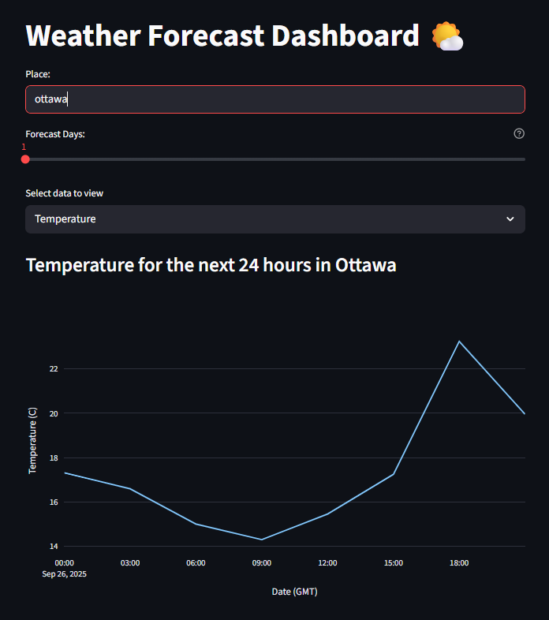

# Weather Forecast App 🌤️
Live Demo: [Try it here](https://kl-weather-forecast-app.streamlit.app/)

A simple Streamlit app built with Python that fetches weather forecast data from OpenWeatherMap and visualizes temperature trends or sky conditions.

This project began as a guided exercise from *The Python Mega Course* and was then extended and refined by me, with additional features, error handling, and deployment.

## Features
- 1–5 day forecast
- Temperature line chart using Plotly
- Weather condition icons (Clear, Clouds, Rain, Snow)
- Error handling for invalid city names and API keys
- Use `.env` (local), Streamlit Secrets (cloud) to keep API key secured

> Note: To run locally, you’ll need a free OpenWeatherMap API key.  
> If you just want to see the app in action, check the **Live Demo** above or the screenshots below.

## Requirements
- Python 3.9+
- OpenWeatherMap API key (free at [https://openweathermap.org/api](https://openweathermap.org/api))

### Python dependencies
- `requirements.in` → direct dependencies (for quick reference)
- `requirements.txt` → full environment with pinned versions

## Setup
Clone the repository and set up a virtual environment:
```bash
git clone https://github.com/KL25725/Weather-Forecast-App.git
cd weather-forecast-app
```

### Windows
```powershell
python -m venv .venv
.venv\Scripts\activate
pip install -r requirements.txt
copy .env.example .env
```

### macOS/Linux
```bash
python3 -m venv .venv
source .venv/bin/activate
pip install -r requirements.txt
cp .env.example .env
```

Then open the new .env file in your text editor and add your API key, then **save**:
```env
OPENWEATHER_API_KEY=your_api_key_here
```

## Run
Start the Streamlit app locally:
```bash
streamlit run app.py
```
Then open the local URL shown in your terminal (usually http://localhost:8501
)
## Project Structure
```graphql
weather-forecast-app/
│
├── backend.py        # Handles API requests to OpenWeatherMap
├── app.py            # Streamlit frontend
├── requirements.in   # Direct dependencies
├── requirements.txt  # Python dependencies
├── .env.example      # Example environment file (do not commit .env)
├── .gitignore        # ignore .env
├── images/           # Weather icons (clear, clouds, rain, snow)
└── README.md         # Project documentation
```
## Example Screenshot

### Dashboard


*Main dashboard with place input, days slider, and data selector.*

### Temperature Chart


*Temperature forecast (1 day) for Ottawa, shown as a line graph.*
### Sky Conditions


*Sky condition forecast (2 days) for Ottawa, with weather icons.*

## Acknowledgements
This project was originally built while following *The Python Mega Course* by Ardit Sulce.
The base version included a hardcoded API key, minimal error handling, and an initial Streamlit interface.  

I extended and polished the app by:
- Securing the API key with `.env` locally and Streamlit Secrets for deployment
- Improving error handling with clear messages for missing API key, invalid city names, and API errors
- Requesting weather data in metric units (°C) via API parameters instead of manual scaling
- Refining the UI (Clearer title, caption, and weather icons)
- Organizing the project with `.gitignore`, `.env.example`, `requirements.txt`, and a structured README
- Deploying the app on Streamlit Cloud, making it available as a live demo